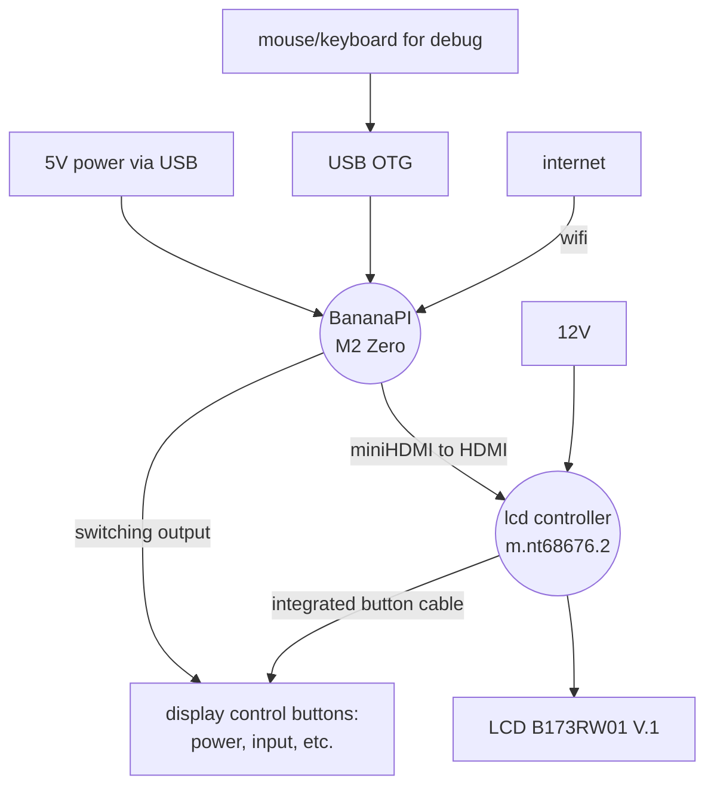
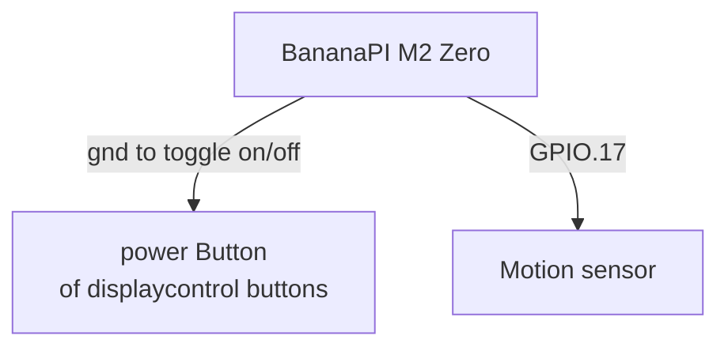

# overview

## Setup

```mermaid
graph TD;
    Screen[LCD B173RW01 V.1]
    lcdcontroller((lcd controller\n m.nt68676.2))
    power[5V power via USB]
    OTG[USB OTG]
    debugperiphery[mouse/keyboard for debug]
    BPI((BananaPI\nM2 Zero))
    ctrlButtons[display control buttons:\npower, input, etc.]
    internet[internet]

    BPI--miniHDMI to HDMI-->lcdcontroller
    lcdcontroller-->Screen;
    lcdcontroller--integrated button cable-->ctrlButtons
    power-->BPI
    debugperiphery-->OTG
    OTG-->BPI
    BPI--switching output-->ctrlButtons
    12V-->lcdcontroller
    internet--wifi-->BPI
```

## Wiring

```mermaid
graph TD;
    bpi[BananaPI M2 Zero]
    powerBtn[power Button\n of displaycontrol buttons]
    motionsensor[Motion sensor]

    bpi --gnd to toggle on/off-->powerBtn
    bpi --GPIO.17--> motionsensor

```

