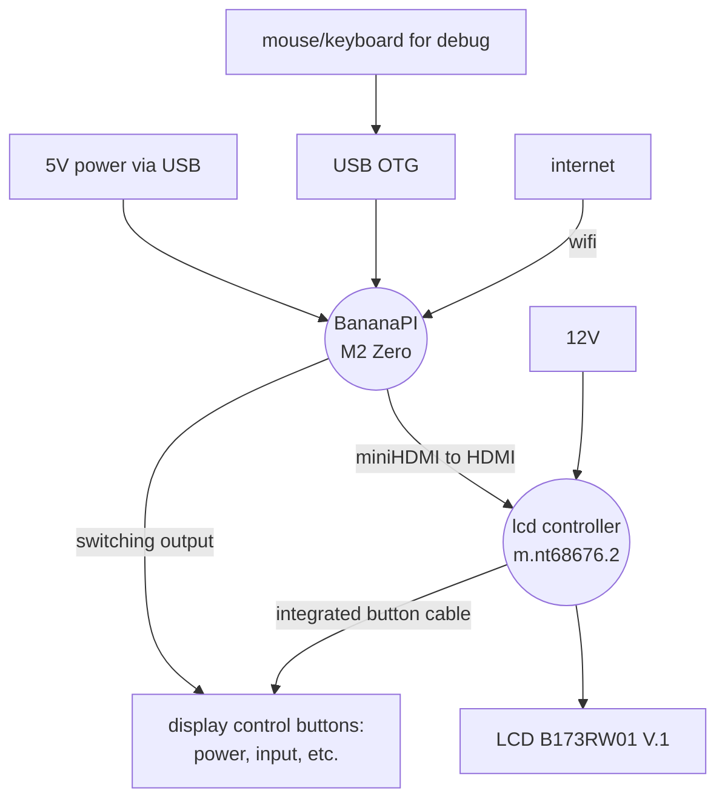

# overview

## Setup
shematic overview on the setup:

## Wiring
The banana pi m2 zero is the heart of the mirror.
Using the motion sensor HC-SR501 PIR the system detects motion to turn the screen on or off.
I wired a transistor in parallel to the power button of the lcd driver board. This allows switching the power button via an output of the banana pi.

here is the circuit diagram:

circuit diagram created with https://www.circuit-diagram.org/editor/, cddx to import can be found in the source code.

