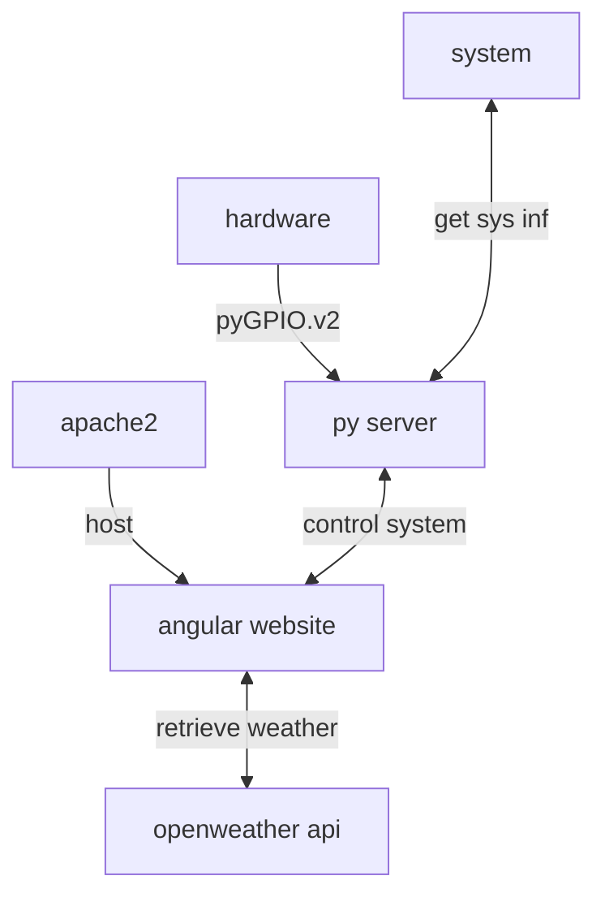

## build and deploy to machine
- pull latest changes / do your local changes
- set variable $target
- run build.sh
  the script will build latest application (ng build), zip the build and copy it to the target
  also python will be copied and pushed
  
## Software architecture
