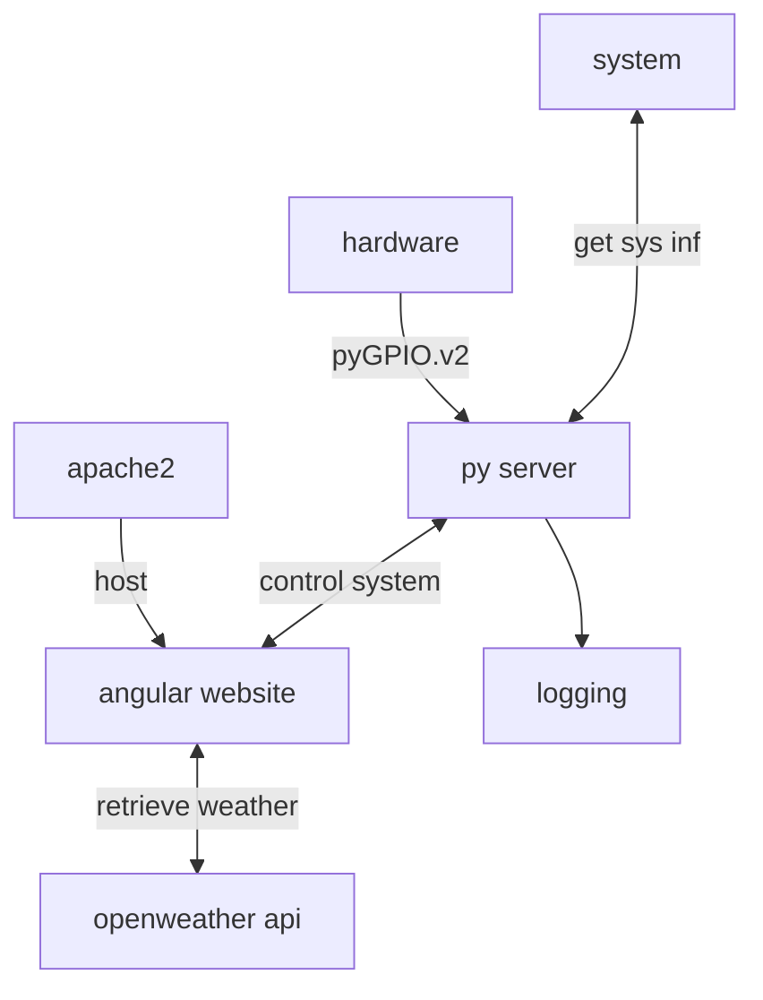
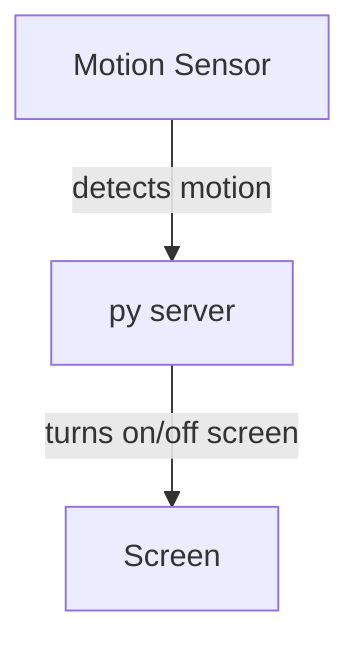

## build and deploy to machine
- pull latest changes / do your local changes
- set variable $target
- run build.sh
  the script will build latest application (ng build), zip the build and copy it to the target
  also python will be copied and pushed

- log files can be found under /var/logs/mirror/server.log
  
## Software architecture

### screen power

Screen is turned off if no motion is detected.
This is to reduce the power consumption

for this the pi has an output directly wired to the power button of the screen controller
see [schematics](electric.md#wiring)

## remote access
the mirror can be connected to via it's public IP with a webbrowser
this allows remote control of the mirror.
be aware that the python server is open to every remote; you should not put it into the open net

